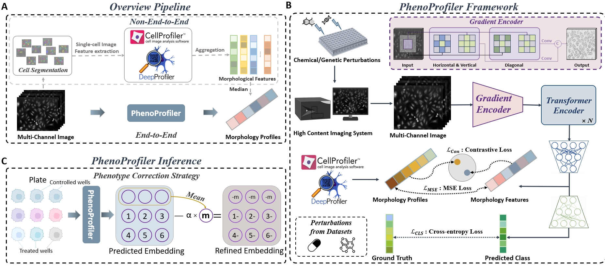

# PhenoProfiler : Learning Morphology Representations in Image-based Phenotypic Drug Discovery

**PhenoProfiler** is an advanced tool for phenotypic profiling of cell morphology, to efficiently and effectively extract phenotypic effects of perturbations from high-throughput imaging. PhenoProfiler operates as an end-to-end image encoder, converting multi-channel images directly into low-dimensional quantitative features, thus eliminating the need for extensive preprocessing in non-end-to-end pipeline. For more details, please refer to our [paper]().

<p align="center">
    
</p>


---

## To be updated:
- **Automated** the model and data download process.
- The `PhenoProfiler` package, which can be installed via `pip install PhenoProfiler`.

---


## Requirements

```
git clone https://github.com/QSong-github/PhenoProfiler.git
cd PhenoProfiler
conda env create -f environment.yaml
conda activate PhenoProfiler
```

## Usage


## Data Preparation

For the datasets download please refer to

